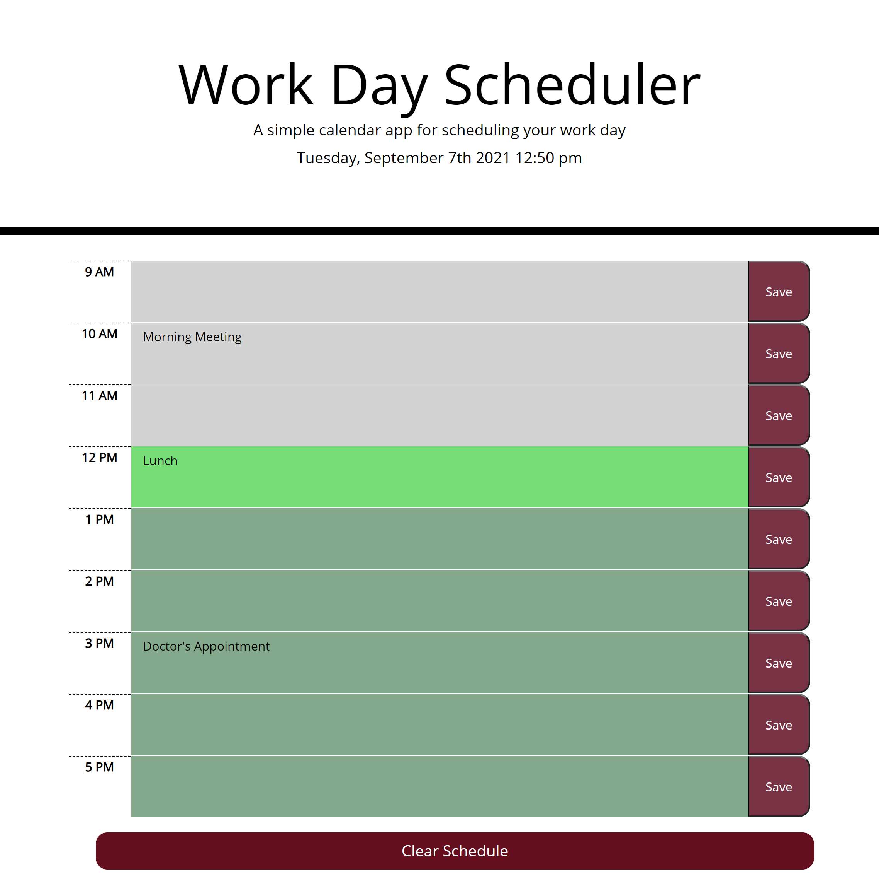

# Simple Day Planner

Link to deployed page: 

## Overview and Functionality

This application is a simple visually-intuitive schedule that allows the user to save events in hour time slots ranging from 9am to 5pm. 

The application feaures dynamically updated HTML and CSS powered by jQuery. This allows the user to input events into the time slots and save them to their local device when they click the save buttons on the right-hand side of each line, so they remain even if the user closes and reopens the application. Utilizing moment.js allows the date at the top of the page, as well as the colors of the time slots, to change in real time to indicate where the user is in their customized schedule.  

At the bottom of the page is a 'Clear Schedule' button that will prompt the user to confirm their choice, in an effort to reduce the chance of accidentally clearing their schedule. If confirmed, the entire schedule will clear and the local data will be wiped, clearing the way for a new schedule. 

## Layout

